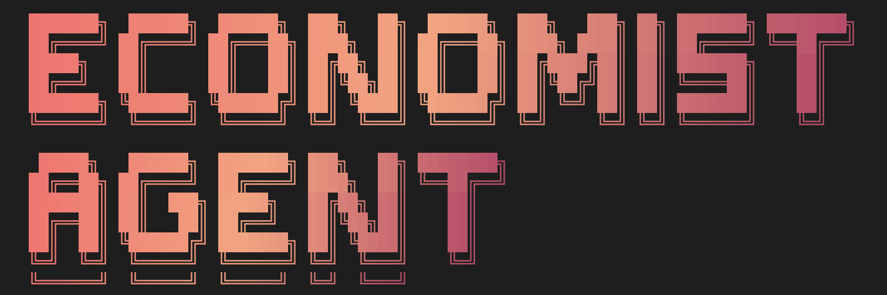

# Economist CLI

[](https://github.com/yigitokar/economist-cli/blob/main/LICENSE)



Economist CLI is a command-line agent that pairs top-tier coding ability with tooling designed for economic research. Ask it to refactor a codebase, run quantitative experiments, or dig through literature — all without leaving your terminal.

## Highlights
- **Top-level coder**: Generates and edits complex projects, explains architecture, and automates repetitive engineering work.
- **Economics-native toolkit**: Optimized prompts, data helpers, and workflow presets built around economic modeling, policy analysis, and reproducible research.
- **Proof Helper**: Formal reasoning assistant for walkthroughs, counterexamples, and publication-ready argument drafts.
- **Deep Research**: Built-in long-form investigation mode that synthesizes multi-source findings using OpenAI advanced models when available.
- **Grounded answers**: On-demand web search, Google grounding, and dataset fetch commands keep responses aligned with current information.
- **MCP friendly**: Works seamlessly with Model Context Protocol servers so you can extend the CLI with your own tools and data connectors.

## Use Cases
- Brainstorm research ideas and sketch experimental designs.
- Translate academic papers into executable simulations or dashboards.
- Automate data cleaning, regression pipelines, and report generation.
- Draft policy memos, blog posts, and investor updates directly from analysis outputs.
- Coordinate long-running projects with saved sessions and reproducible notebooks.

## Install
**Requirements:** Node.js 20+ on macOS, Linux, or Windows.

Choose the flow that fits your setup:

```bash
# Try immediately
npx @careresearch/econ-agent

# Install globally
npm install -g @careresearch/econ-agent

# Local clone (contribute or customize)
git clone https://github.com/yigitokar/economist-cli
cd economist-cli
npm install && npm run build
```

## Initial Setup
1. **Launch the CLI:** Run `economist` and follow the prompt to sign in with your Google account for Gemini access, or supply an API key via environment variables.
2. **Enable OpenAI-powered tools (optional):** Set `OPENAI_API_KEY` in your shell or a `.env` file to unlock Deep Research and Proof Helper features that rely on OpenAI models.
3. **Project context (optional):** Drop an `ECON.md` or `.economist/context.md` file in your repo to preload research goals, datasets, or style guidance.

Example `.env` snippet:

```dotenv
GEMINI_API_KEY=your-gemini-key
OPENAI_API_KEY=your-openai-key
GOOGLE_API_KEY=your-grounding-key
```

## Quick Start
```bash
# Open an interactive workspace in the current project
economist

# Include extra folders when building context
economist --include-directories ../data --include-directories ../models

# Run a one-off prompt without entering the UI
economist --prompt "Design a DSGE calibration workflow for the attached data"

# Manage installed MCP servers
economist mcp list
```

Inside the interactive session, open the command palette (`Cmd/Ctrl + K`) to launch Proof Helper, Deep Research, and other specialist tools.

Use `economist --help` at any time to explore available commands and flags.

## Next Steps
- Read the docs in `docs/` for advanced configuration and MCP integrations.
- File feedback or feature requests via [GitHub Issues](https://github.com/yigitokar/economist-cli/issues).
- Licensed under [Apache-2.0](https://github.com/yigitokar/economist-cli/blob/main/LICENSE).
