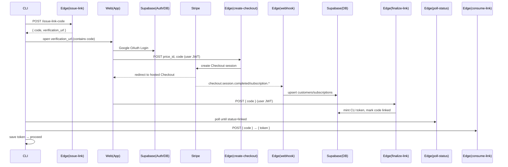

# Authentication, Paywall, and Onboarding (Economist CLI Pro)

This document captures the decisions and implementation details for moving Economist CLI to a paid product with a terminal‑native onboarding flow.

- All functionality is gated behind a paywall (Economist CLI Pro).
- Users authenticate and pay in the browser, while the CLI performs a secure device‑link handshake and proceeds automatically on success.

## Product decisions

- **Paywall scope**: 100% gated. The CLI requires an active subscription before it becomes usable.
- **Plan**: Pro Monthly — $20/month.
- **Entitlements**: Pro unlocks all features (e.g., deep research, proof helper, higher limits). Enforcement is performed server‑side via Supabase Edge Functions.
- **No local API keys**: User API keys (e.g., OpenAI) are stored server‑side in Supabase and used only by Edge Functions. The CLI never stores or transmits user API keys.

## High‑level architecture

- **Supabase** is the control plane (Auth, DB, RLS, RPCs, Edge Functions, Stripe webhooks).
- **Stripe** handles payment and subscription lifecycle.
- **Device‑link flow** connects a headless CLI session with a user’s browser session and Stripe checkout.
- **CLI token** is minted after successful signup + payment and stored locally (keychain planned), used for Pro API calls.

## Supabase project

- Project: `econ_cli`
- Project ID: `giefigqpffbszyozgzkk`
- URL: `https://giefigqpffbszyozgzkk.supabase.co`

### Extensions

- `pgsodium` — encryption (vault key for secrets)
- `pgcrypto`

### Database schema (summary)

- `profiles(user_id, email, name, created_at)` — RLS owner‑only
- `customers(user_id, stripe_customer_id)` — RLS owner‑only
- `subscriptions(id, user_id, stripe_subscription_id, product_id, price_id, status, current_period_end, metadata)` — RLS read owner; writes via service role/webhooks only
- `device_links(code, user_id, status[pending|linked|expired], client_reference_id, created_at, expires_at, minted_token, minted_token_expires_at)` — managed by Edge Functions (service role)
- `cli_tokens(id, user_id, token_hash, device_label, scopes[], created_at, last_used_at, expires_at)` — RLS read owner; writes via service role
- `secrets(id, user_id, name, ciphertext, nonce, created_at, updated_at)` — RLS owner‑only
- RPCs: `secrets_set`, `secrets_get`, `secrets_list`, `secrets_delete`, `get_entitlements`
- Encryption helpers (SECURITY DEFINER): `internal.secrets_encrypt`, `internal.secrets_decrypt` with a pgsodium key named `economist_cli_secrets_key`

## Edge Functions (Supabase)

Public (pre‑auth) — should NOT require JWT verification:

- `issue-link-code`
  - Creates a device link row with a short `code` and 15‑min expiry.
  - Returns `{ code, verification_url }`.
- `poll-link-status` (GET)
  - Returns `{ status: pending|linked|expired }`.
- `consume-link`
  - One‑time exchange after link: returns `{ token }` and clears it from the `device_links` row.

Authenticated (require user JWT):

- `create-checkout-session`
  - Takes `price_id` (defaults to `STRIPE_PRICE_PRO_MONTHLY`) and `code`.
  - Creates Stripe Checkout; success redirects to `/success?session_id=...&code=...`.
- `confirm-checkout`
  - Given `session_id` and `code`, upserts `customers` and `subscriptions` from Stripe API.
- `create-billing-portal`
  - Returns Stripe Billing Portal session URL.
- `finalize-link`
  - Validates user entitlements via `get_entitlements`.
  - Mints a `cli_tokens` token (hash stored) and updates `device_links` with a one‑time token.
- `stripe-webhook`
  - Handles `checkout.session.completed` and `customer.subscription.*` to keep subscriptions in sync.

> Note: Public functions do not require a user session. They can remain with `verify_jwt` enabled and accept the project's ANON JWT (`Authorization: Bearer <SUPABASE_ANON_KEY>`). Authenticated functions require a Supabase user JWT and are invoked from the onboarding web app.

### Required environment variables (Edge Functions)

- `SUPABASE_URL` — your project URL
- `SUPABASE_ANON_KEY` — anon key (used by web app + CLI for public functions)
- `SUPABASE_SERVICE_ROLE_KEY` — service role (Edge Functions only)
- `APP_BASE_URL` — e.g., `https://econ_agent.com`
- `STRIPE_SECRET_KEY` — Stripe secret
- `STRIPE_WEBHOOK_SECRET` — Stripe webhook signing secret
- `STRIPE_PRICE_PRO_MONTHLY` — Stripe price ID for $20/mo plan

## Stripe configuration

- Product: “Economist Pro”
- Price: $20/month (use the resulting `price_xxx` as `STRIPE_PRICE_PRO_MONTHLY`)
- Webhook events to enable:
  - `checkout.session.completed`
  - `customer.subscription.created`
  - `customer.subscription.updated`
  - `customer.subscription.deleted`

## CLI integration

- Entry point: `packages/cli/src/gemini.tsx`
  - We call `ensureProOnboarding()` before the CLI initializes.
- Onboarding helper: `packages/cli/src/services/proOnboarding.ts`
  - Calls `issue-link-code` → opens browser → polls `poll-link-status` → calls `consume-link` → saves token.
  - Token storage (temporary): `~/.economist/session.json`.
  - Next step: migrate to OS keychain (`keytar`) for secure storage.

### CLI environment variables (for local dev)

- `SUPABASE_URL=https://giefigqpffbszyozgzkk.supabase.co`
- `SUPABASE_ANON_KEY=...` (Project Settings → API)

> The CLI only calls public (pre‑auth) functions during onboarding. After linking, it will call Pro functions using the minted CLI token.

## Secrets management

- All user API keys are stored server‑side in `public.secrets` encrypted with `pgsodium`.
- RPCs:
  - `secrets_set(name, value)` — encrypts and upserts
  - `secrets_get(name)` — decrypts and returns
  - `secrets_list()` — lists names and timestamps
  - `secrets_delete(name)` — deletes
- Recommended pattern for Pro features: Edge Functions load the user’s key server‑side and proxy the external API call (keys never leave the server).

## Security considerations

- **RLS**: every table with user data enforces `auth.uid() = user_id`.
- **Service role usage**: only inside Edge Functions for privileged operations (e.g., writing tokens/subscriptions).
- **CLI tokens**: stored hashed in `cli_tokens.token_hash`; the one‑time token in `device_links` is ephemeral and cleared on consumption.
- **Public vs Auth Edge Functions**: device‑link endpoints must be public; payment and linking finalization must be authenticated with the user JWT.
- **No secrets in repo**: Keys must be configured only as environment variables in Supabase/Stripe.
- **Rate limiting**: consider basic rate limiting for `issue-link-code` and `poll-link-status` to prevent abuse.

## Onboarding web app (to build)

- Framework: Next.js (or similar) with `@supabase/supabase-js`.
- Pages:
  - `/sign-up?code=XXXX`: Google OAuth → call `create-checkout-session(code)` and redirect to Stripe Checkout.
  - `/success?session_id=...&code=...`: call `confirm-checkout`, then `finalize-link(code)`.
  - `/portal`: call `create-billing-portal` and redirect.

## Testing checklist

- Stripe (test mode): create product/price, set webhook pointing to `stripe-webhook` function URL.
- Run Stripe CLI to forward events to your Edge function in dev.
- Validate device‑link happy path and timeouts.
- Confirm subscription sync after webhook arrival and via `confirm-checkout` fallback.

## Future work

- Move local token storage to OS keychain (`keytar`).
- Add CLI commands:
  - `economist login` (rerun device link)
  - `economist whoami` (show plan/expiry)
  - `economist logout` (revoke token + clear storage)
  - `economist billing subscribe|portal|status`
  - `economist secrets set|get|list|delete`
- Add rate limits and telemetry (consented) for operational insight.

---

If you change plan structure or move features between public/Pro, update this doc and the Edge Function logic accordingly.
