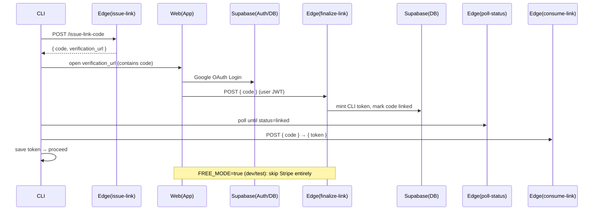

# Authentication, Paywall, and Onboarding (Economist CLI Pro)

This document captures the decisions and implementation details for moving Economist CLI to a paid product with a terminal‑native onboarding flow.

- All functionality is gated behind a paywall (Economist CLI Pro).
- Users authenticate and pay in the browser, while the CLI performs a secure device‑link handshake and proceeds automatically on success.

## Product decisions

- **Paywall scope**: 100% gated. The CLI requires an active subscription before it becomes usable.
- **Plan**: Pro Monthly — $20/month.
- **Entitlements**: Pro unlocks all features (e.g., deep research, proof helper, higher limits). Enforcement is performed server‑side via Supabase Edge Functions.
- **No local API keys**: User API keys (e.g., OpenAI) are stored server‑side in Supabase and used only by Edge Functions. The CLI never stores or transmits user API keys.

## High‑level architecture

- **Supabase** is the control plane (Auth, DB, RLS, RPCs, Edge Functions).
- **Stripe (optional)** handles payment and subscription lifecycle when enabled.
- **Device‑link flow** connects a headless CLI session with a user’s browser session. In FREE_MODE, we skip Stripe and mint a token after login.
- **CLI token** is minted after successful signup and stored locally (keychain planned), used for Pro API calls.

## Supabase project

- Project: `econ_cli`
- Project ID: `giefigqpffbszyozgzkk`
- URL: `https://giefigqpffbszyozgzkk.supabase.co`

## Current dev status (FREE_MODE)

- FREE_MODE is enabled for development/testing: `supabase secrets set FREE_MODE="true"`.
- The onboarding web app calls `finalize-link` directly after Google login (Stripe is skipped).
- The `finalize-link` Edge Function was redeployed with FREE_MODE support.
- CLI token linking is fully functional end-to-end without payment.
- To re-enable Stripe later, set `FREE_MODE=false` and restore the original `/sign-up` flow (see Stripe section below).

### Extensions

- `pgsodium` — encryption (vault key for secrets)
- `pgcrypto`

### Database schema (summary)

- `profiles(user_id, email, name, created_at)` — RLS owner‑only
- `customers(user_id, stripe_customer_id)` — RLS owner‑only
- `subscriptions(id, user_id, stripe_subscription_id, product_id, price_id, status, current_period_end, metadata)` — RLS read owner; writes via service role/webhooks only
- `device_links(code, user_id, status[pending|linked|expired], client_reference_id, created_at, expires_at, minted_token, minted_token_expires_at)` — managed by Edge Functions (service role)
- `cli_tokens(id, user_id, token_hash, device_label, scopes[], created_at, last_used_at, expires_at)` — RLS read owner; writes via service role
- `secrets(id, user_id, name, ciphertext, nonce, created_at, updated_at)` — RLS owner‑only
- RPCs: `secrets_set`, `secrets_get`, `secrets_list`, `secrets_delete`, `get_entitlements`
- Encryption helpers (SECURITY DEFINER): `internal.secrets_encrypt`, `internal.secrets_decrypt` with a pgsodium key named `economist_cli_secrets_key`

## Edge Functions (Supabase)

Public (pre‑auth) — should NOT require JWT verification:

- `issue-link-code`
  - Creates a device link row with a short `code` and 15‑min expiry.
  - Returns `{ code, verification_url }`.
- `poll-link-status` (GET)
  - Returns `{ status: pending|linked|expired }`.
- `consume-link`
  - One‑time exchange after link: returns `{ token }` and clears it from the `device_links` row.

Authenticated (require user JWT):

- `finalize-link`
  - Mints a `cli_tokens` token (hash stored) and updates `device_links` with a one‑time token.
  - In FREE_MODE, skips entitlement checks; in paid mode, validates via `get_entitlements`.
- Stripe-related (only when Stripe is enabled):
  - `create-checkout-session`, `confirm-checkout`, `create-billing-portal`, `stripe-webhook`

> Note: Public functions do not require a user session. They can remain with `verify_jwt` enabled and accept the project's ANON JWT (`Authorization: Bearer <SUPABASE_ANON_KEY>`). Authenticated functions require a Supabase user JWT and are invoked from the onboarding web app.

### Required environment variables (Edge Functions)

- `SUPABASE_URL` — your project URL
- `SUPABASE_ANON_KEY` — anon key (used by web app + CLI for public functions)
- `SUPABASE_SERVICE_ROLE_KEY` — service role (Edge Functions only)
- `APP_BASE_URL` — e.g., `https://econ_agent.com` or `http://localhost:3000`
- `FREE_MODE` — set to `true` to skip Stripe (dev/test)
- Stripe variables (only when Stripe is enabled):
  - `STRIPE_SECRET_KEY`
  - `STRIPE_WEBHOOK_SECRET`
  - `STRIPE_PRICE_PRO_MONTHLY`

## Stripe configuration (optional)

When `FREE_MODE=true`, Stripe is disabled and not required for onboarding. To enable Stripe later:

- Create Product “Economist Pro” and a $20/month Price → set `STRIPE_PRICE_PRO_MONTHLY`.
- Add webhook to `stripe-webhook` with events: checkout.session.completed, customer.subscription.created/updated/deleted.
- Set `STRIPE_SECRET_KEY` and `STRIPE_WEBHOOK_SECRET` in Supabase secrets.

## CLI integration

- Entry point: `packages/cli/src/gemini.tsx`
  - We call `ensureProOnboarding()` before the CLI initializes.
- Onboarding helper: `packages/cli/src/services/proOnboarding.ts`
  - Calls `issue-link-code` → opens browser → polls `poll-link-status` → calls `consume-link` → saves token.
  - Token storage (temporary): `~/.economist/session.json`.
  - Next step: migrate to OS keychain (`keytar`) for secure storage.

### CLI environment variables (for local dev)

- `SUPABASE_URL=https://giefigqpffbszyozgzkk.supabase.co`
- `SUPABASE_ANON_KEY=...` (Project Settings → API)

> The CLI only calls public (pre‑auth) functions during onboarding. After linking, it will call Pro functions using the minted CLI token.
> In FREE_MODE, the web app calls `finalize-link` directly after login (no Stripe).

### CLI auth commands

- `/login` (aliases: `/link`, `/sign-in`)
  - Starts the device-link flow from the terminal: issues a code, opens the sign-up URL, polls status, consumes token, and saves it locally.
- `/whoami` (alias: `/status`)
  - Shows whether you are linked via environment variable (`ECONOMIST_CLI_TOKEN`) or via the saved session file.
- `/sign-out` (aliases: `/logout`, `/signout`)
  - Removes the local session file to sign out. If `ECONOMIST_CLI_TOKEN` is set, you’ll be reminded to unset it.

Token persistence
- Saved file: `~/.economist/session.json` (hashed token stored server-side; local file stores the one-time token for reuse).
- ENV override: `ECONOMIST_CLI_TOKEN` takes precedence over the saved file.

### CLI local .env (auto-loaded)

- The CLI runner (`scripts/start.js`) auto-loads environment variables from `economist-cli/.env`.
- Required entries:
  - `SUPABASE_URL=https://giefigqpffbszyozgzkk.supabase.co`
  - `SUPABASE_ANON_KEY=<your anon key>`
- These are separate from `packages/web/.env.local` (which uses `NEXT_PUBLIC_...`).

### APP_BASE_URL and ports

- `APP_BASE_URL` must match your running Next.js dev server:
  - `http://localhost:3000` (recommended) or `http://localhost:3001` if 3000 is busy.
- Update with: `supabase secrets set APP_BASE_URL="http://localhost:3000"`.

## Secrets management

- All user API keys are stored server‑side in `public.secrets` encrypted with `pgsodium`.
- RPCs:
  - `secrets_set(name, value)` — encrypts and upserts
  - `secrets_get(name)` — decrypts and returns
  - `secrets_list()` — lists names and timestamps
  - `secrets_delete(name)` — deletes
- Recommended pattern for Pro features: Edge Functions load the user’s key server‑side and proxy the external API call (keys never leave the server).

## Security considerations

- **RLS**: every table with user data enforces `auth.uid() = user_id`.
- **Service role usage**: only inside Edge Functions for privileged operations (e.g., writing tokens/subscriptions).
- **CLI tokens**: stored hashed in `cli_tokens.token_hash`; the one‑time token in `device_links` is ephemeral and cleared on consumption.
- **Public vs Auth Edge Functions**: device‑link endpoints must be public; payment and linking finalization must be authenticated with the user JWT.
- **No secrets in repo**: Keys must be configured only as environment variables in Supabase/Stripe.
- **Rate limiting**: consider basic rate limiting for `issue-link-code` and `poll-link-status` to prevent abuse.

## Onboarding web app

- Framework: Next.js (or similar) with `@supabase/supabase-js`.
- Pages:
  - `/sign-up?code=XXXX`: Google OAuth → call `finalize-link(code)` directly (FREE_MODE).
  - When Stripe is enabled, `/sign-up` will call `create-checkout-session` and `/success` will call `confirm-checkout` then `finalize-link`.
  - `/portal` (billing) only when Stripe is enabled.

## Testing checklist

- Validate device‑link happy path and timeouts (FREE_MODE).
- Optional: enable Stripe later and test checkout, webhook delivery, and subscription sync.

## Future work

- Move local token storage to OS keychain (`keytar`).
- Add CLI commands:
  - `economist login` (rerun device link)
  - `economist whoami` (show plan/expiry)
  - `economist logout` (revoke token + clear storage)
  - `economist billing subscribe|portal|status`
  - `economist secrets set|get|list|delete`
- Add rate limits and telemetry (consented) for operational insight.

---

If you change plan structure or move features between public/Pro, update this doc and the Edge Function logic accordingly.
